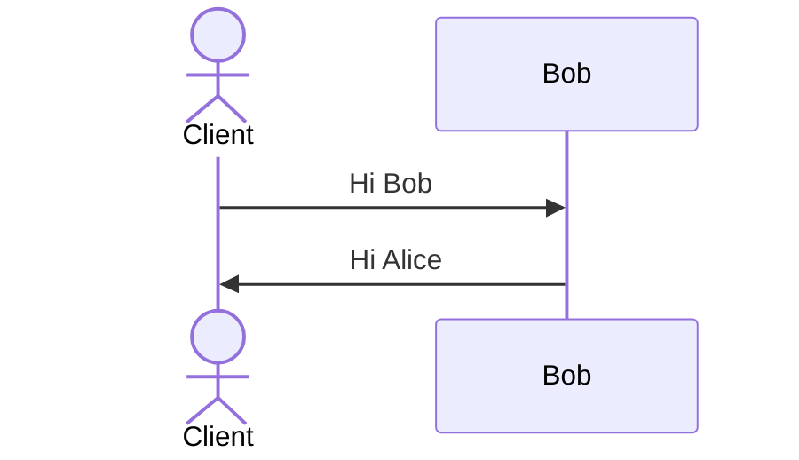
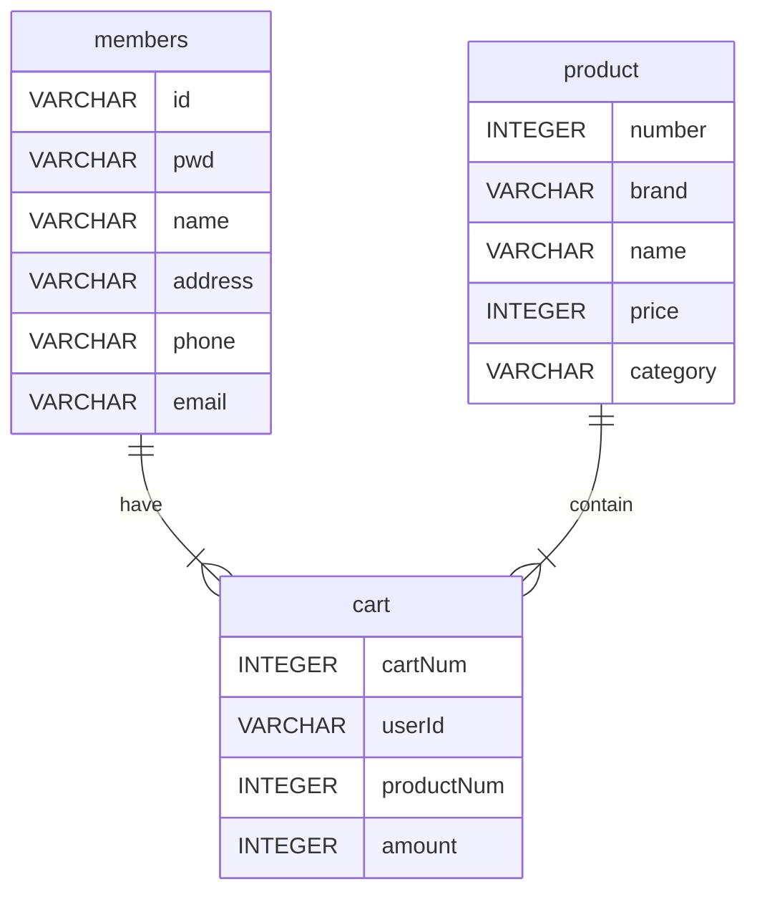

## :lock: Team Code Convention

### Git Commit Message

| 커밋명   | 내용                                        |
| -------- | ------------------------------------------- |
| feat     | 파일, 폴더, 새로운 기능 추가                |
| fix      | 버그 수정                                   |
| docs     | 제품 코드 수정 없음                         |
| style    | 코드 형식, 정렬, 주석 등의 변경             |
| refactor | 코드 리팩토링                               |
| test     | 테스트 코드 추가                            |
| chore    | 환경설정, 빌드 업무, 패키지 매니저 설정등.. |
| hotfix   | 치명적이거나 급한 버그 수정                 |
| remove   | 사용하지 않는 변수, 파일 etc 삭제           |
| working  | 이미 만들어진 기능, 함수 작업중             |
| merge    | branch merge                                |

### Branch

| 브랜치명 | 내용                         |
| -------- | ---------------------------- |
| develop  | 파일, 폴더, 새로운 기능 추가 |
| fix      | 버그 수정                    |
| docs     | 제품 코드 수정 없음          |
| refactor | 코드 리팩토링                |
| hotfix   | 치명적이거나 급한 버그 수정  |
| feat     | 새로운 기능 추가             |

## :file_folder: Data Base
### DB Build

| 순서 | 상세설명                         |
| -------- | ---------------------------- |
| docker desktop 설치  | https://www.docker.com/ |
| PostgreSQL 설치      | docker run --name postgres -e POSTGRES_PASSWORD=mysecretpassword -p 5432:5432 -d postgres    |
| PostgreSQL 내 psql 실행     | docker exec -it postgres psql -U postgres     |
| 사용자 생성 (psql 접속 후) | create user munsoo with encrypted password 'munsoo';      |
| 데이터베이스 생성 (psql 접속 후)  | create database project owner munsoo; |
| 데이터베이스 접속 (psql 접속시)     | docker exec -it postgres psql -U munsoo -d project;     |
| PostgreSQL 서비스 구동/중지     | docker start postgres   /   docker stop postgres    |
| PostgreSQL 사용법 (인터넷자료)     | https://velog.io/@gwak2837/%EB%8D%B0%EC%9D%B4%ED%84%B0%EB%B2%A0%EC%9D%B4%EC%8A%A4-%EC%8B%9C%EC%8A%A4%ED%85%9C-%EC%8B%A4%EC%8A%B52 |


### DB Default Setting

#### Create Member Table
```sql
CREATE TABLE MEMBERS(
   ID VARCHAR(50) PRIMARY KEY,
   PWD VARCHAR(100) not null,
   NAME  VARCHAR(50) not null,
   ADDRESS VARCHAR(200) not null,
   PHONE VARCHAR(15) not null,
   EMAIL VARCHAR(50) not null
);
```
#### Insert Member Data
```sql
INSERT INTO members
VALUES
(
   'testId1',
   'testPw1',
   'testName1',
   'testAddress1',
   'testPhone1',
   'testEmail1'
),
(
   'testID2',
   'testPw2',
   'testName2',
   'testAddress2',
   'testPhone2',
   'testEmail2'
),
(
   'testID3',
   'testPw3',
   'testName3',
   'testAddress3',
   'testPhone3',
   'testEmail3'
),
(
   'testID4',
   'testPw4',
   'testName4',
   'testAddress4',
   'testPhone4',
   'testEmail4'
),
(
   'testID5',
   'testPw5',
   'testName5',
   'testAddress5',
   'testPhone5',
   'testEmail5'
);
```
#### Create Product Table
```sql
CREATE TABLE product(
   number INTEGER PRIMARY KEY,
   brand VARCHAR(50) not null,
   name VARCHAR(50) not null,
   price  INTEGER not null,
   category VARCHAR(10) not null
);
```
#### Insert Product Data
```sql
INSERT INTO product
VALUES
(
   1111,
   '수아레',
   '워셔블 니트',
   39900,
   'TOP'
),
(
   2222,
   '스파오',
   '(시티보이) 오버핏 옥스포드 셔츠',
   35910,
   'TOP'
),
(
   3333,
   '예일',
   '2 TONE ARCH HOODIE GRAY',
   63200,
   'TOP'
),
(
   4214124,
   '어반드레스',
   'SHINE SLIM ONEPIECE SKY',
   26550,
   'DRESS'
),
(
   15515,
   '하트클럽',
   'HEART 21 카라 리본 로고 드레스',
   109000,
   'DRESS'
),
(
   567567,
   '파르티',
   '멘토 오바사이즈 롱 코트',
   46500,
   'OUTER'
),
(
   464578,
   '스파오',
   '파스텔 푸퍼',
   39900,
   'OUTER'
),
(
   53736,
   '제로',
   'Deep One Tuck Sweat Pants',
   39000,
   'BOTTOM'
);
```
#### Create# Cart Table

```sql
CREATE TABLE cart(
   cartNum INTEGER PRIMARY KEY,
   userId VARCHAR(50) REFERENCES members(id),
   productNum INTEGER REFERENCES product(number),
   amount INTEGER not null
);
```
#### Insert Cart Data (munsoo, munsoo2 먼저 회원가입 필수)
```sql
INSERT INTO cart
VALUES
(
   1,
   'munsoo',
   567567,
   2
),
(
   2,
   'munsoo',
   1111,
   1
),
(
   3,
   'munsoo',
   2222,
   4
),
(
   4,
   'munsoo2',
   3333,
   10
),
(
   5,
   'munsoo2',
   4214124,
   2
);
```


## :page_with_curl: Diagram
### Sequence Diagram

### Entity Relationship Diagrams


## :disappointed_relieved: 미구현 항목

회원가입 기능
   - 아이디 중복, 비밀번호 확인 미충족시 회원가입 불가 기능 추가

상품 목록 기능
   - 페이지네이션
   
장바구니 기능
   - check box 출력
   - 수량 변경 기능
   - 합계 기능
   - 장바구니 멀티 삭제 기능

마이페이지 기능
   - 전체
   - 주문확인 기능 추가

주문 기능
   - 전체
   - 항공편 입력 기능 추가

결제 기능
   - 전체
   - 결제 시스템 구현 추가

환율 기능
   - 전체

언어 기능
   - 전체
